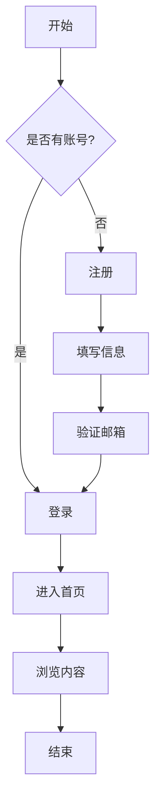
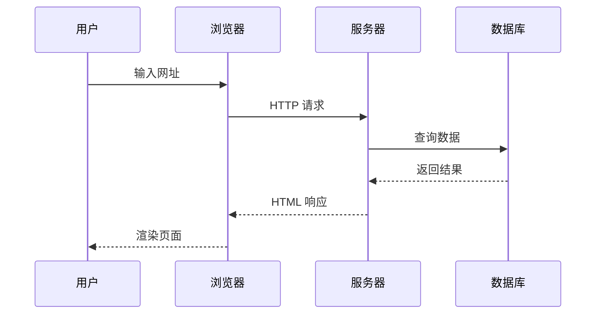
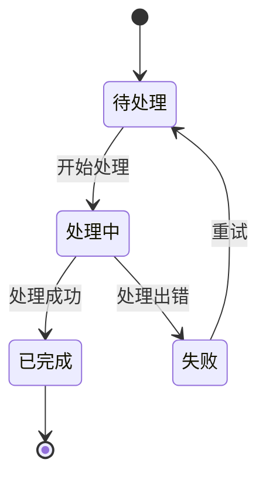
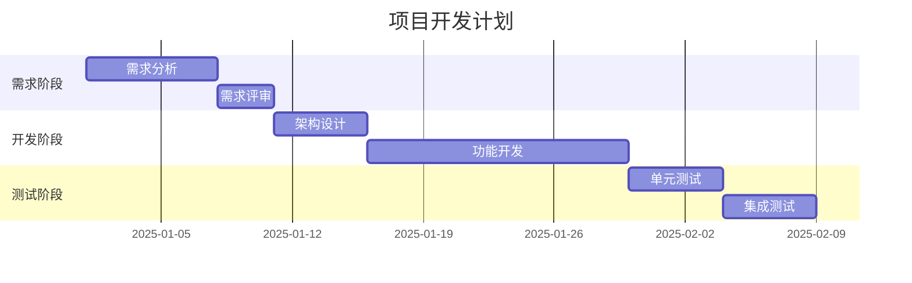
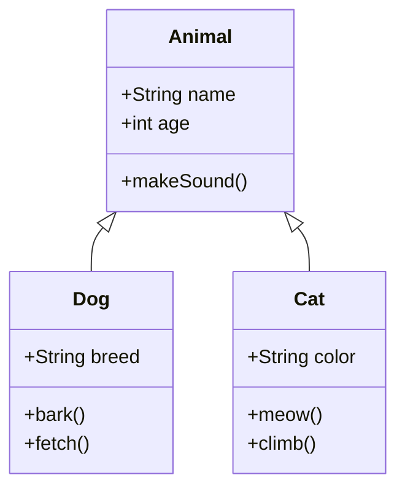
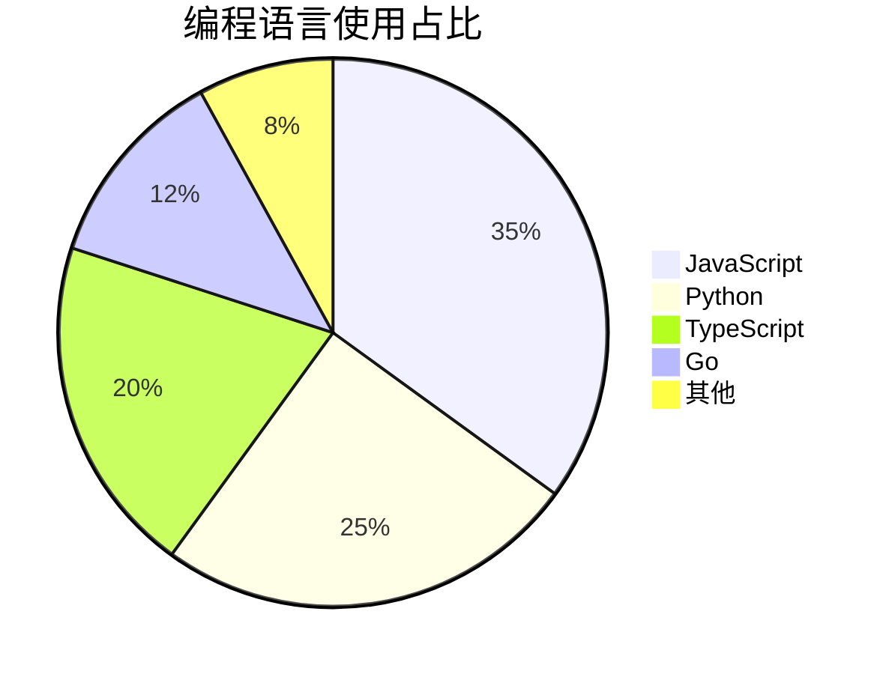
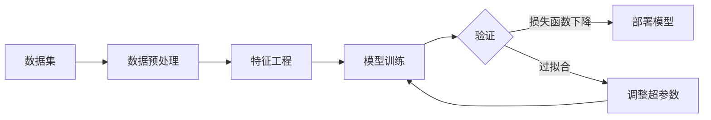

本博客系统现已支持 **Mermaid 图表** 和 **LaTeX 数学公式** 渲染功能。这两个功能可以帮助你更好地展示复杂的概念和数据。

## Mermaid 图表

[Mermaid](https://mermaid.js.org/) 是一个基于 JavaScript 的图表绘制工具，可以使用类似 Markdown 的语法创建各种图表。

### 流程图 (Flowchart)

流程图用于描述流程或算法的步骤：

### 时序图 (Sequence Diagram)

时序图展示对象之间的交互顺序：

### 状态图 (State Diagram)

状态图描述系统的状态转换：

### 甘特图 (Gantt Chart)

甘特图用于项目进度管理：

### 类图 (Class Diagram)

类图展示类之间的关系：

### 饼图 (Pie Chart)

饼图用于展示数据占比：

---

## LaTeX 数学公式

LaTeX 是科学和技术领域广泛使用的排版系统，特别适合编写数学公式。

### 行内公式

行内公式使用单个美元符号 `$...$` 包裹。

例如，著名的质能方程 $E = mc^2$，其中 $E$ 是能量，$m$ 是质量，$c$ 是光速。

再比如，圆的面积公式是 $A = \pi r^2$，周长公式是 $C = 2\pi r$。

### 独立公式块

独立公式使用双美元符号 `$$...$$` 包裹，会居中显示。

#### 二次方程求根公式

$$
x = \frac{-b \pm \sqrt{b^2 - 4ac}}{2a}
$$

#### 欧拉公式

这是数学中最优美的公式之一：

$$
e^{i\pi} + 1 = 0
$$

#### 高斯积分

$$
\int_{-\infty}^{\infty} e^{-x^2} dx = \sqrt{\pi}
$$

#### 矩阵

矩阵乘法示例：

$$
\begin{pmatrix}
a & b \\
c & d
\end{pmatrix}
\begin{pmatrix}
x \\
y
\end{pmatrix}
=
\begin{pmatrix}
ax + by \\
cx + dy
\end{pmatrix}
$$

#### 求和与连乘

求和公式 (1 到 n 的平方和)：

$$
\sum_{i=1}^{n} i^2 = \frac{n(n+1)(2n+1)}{6}
$$

阶乘的定义：

$$
n! = \prod_{k=1}^{n} k = 1 \times 2 \times 3 \times \cdots \times n
$$

#### 极限

极限的经典定义：

$$
\lim_{x \to 0} \frac{\sin x}{x} = 1
$$

#### 微分方程

简谐运动的微分方程：

$$
\frac{d^2 x}{dt^2} + \omega^2 x = 0
$$

#### 泰勒展开

$e^x$ 的泰勒展开：

$$
e^x = \sum_{n=0}^{\infty} \frac{x^n}{n!} = 1 + x + \frac{x^2}{2!} + \frac{x^3}{3!} + \cdots
$$

#### 傅里叶变换

$$
\hat{f}(\xi) = \int_{-\infty}^{\infty} f(x) e^{-2\pi i x \xi} dx
$$

---

## 结合使用

你可以在同一篇文章中同时使用 Mermaid 图表和 LaTeX 公式，以更好地表达复杂的概念。

例如，下面是一个描述机器学习训练流程的图表：

其中，常用的损失函数包括均方误差 (MSE)：

$$
\text{MSE} = \frac{1}{n} \sum_{i=1}^{n} (y_i - \hat{y}_i)^2
$$

以及交叉熵损失：

$$
\text{Cross-Entropy} = -\sum_{i} y_i \log(\hat{y}_i)
$$

---

## 总结

通过 Mermaid 和 LaTeX 的支持，你可以：

- 使用 **Mermaid** 绘制流程图、时序图、甘特图等各种图表
- 使用 **LaTeX** 编写行内公式和独立公式块
- 两者结合使用，更好地表达技术概念

这些功能让博客内容更加丰富和专业。快来试试吧！
